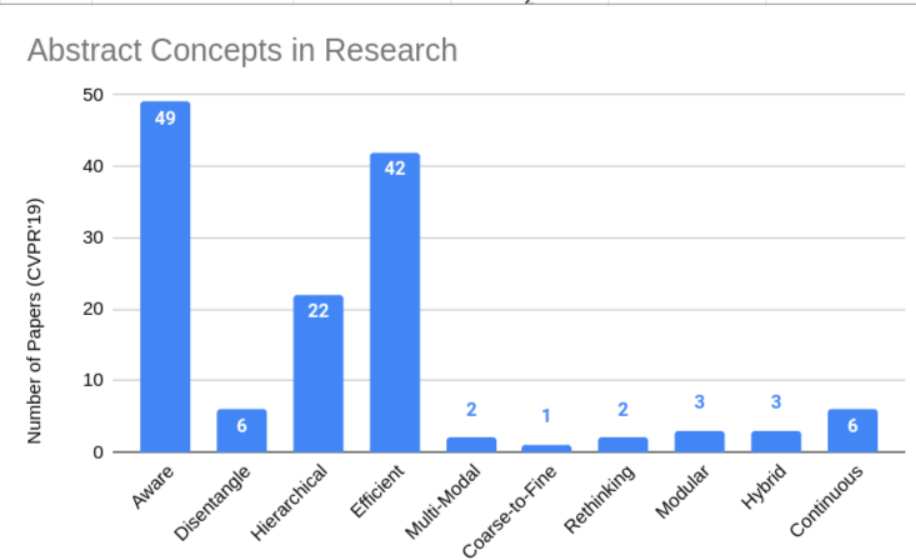

<!-- This post will show up by default. To disable scheduling of future posts, edit `config.yml` and set `future: false`.  -->

# Synthesis of New Ideas

Synthesis of new ideas is an imperative part of research to produce novelty. However, a variety of research papers reuse the similar abstract concepts in a different context or domain. As such, effectively mining such abstract concepts can allow a more programmable approach of synthesizing novel ideas, allowing computers the power of creating novelty.

Considering the research in computer science is more based on generation of such ideas rather than discovery, new problems or solutions to work upon can be generated by figuring out the sensible ideas from a brute force hitting with these abstract concepts. It is however uncertain whether such approaches allow for breakthroughs the problem, or just are incremental in nature.

Good Researchers can usually follow the advent of such abstract concepts that are currently trending and prevalent in field. An evidence of this can been in deep learning research from the high volume of the papers published.

## Common Abstract Concepts in CS and AI Research

Fig shows the

## A New Top Paper generally introduces a new abstract concept to the field, which is then adopted by several researchers in the field, and more subsequent research is done.

# Mining Abstract Ideas

<!-- ## Use of Abstract Ideas in Innovation : "Aware", "Disentangling", "Review", "Analysis", "Dissection", "Joining Multiple Ideas", "System Proposed from a Goal", "Automation", "Tool or Library", "Theoretical Analysis", "Discrete-Continous Conversion", "Rethinking", "Finding Solution to Limitations", "Working in Parallel Modalities", "Solving for Corner Cases and Non-Ideal Behaviour" -->
